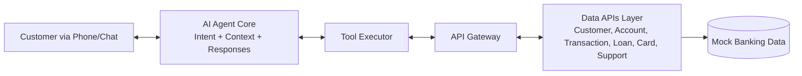

# Banking Call Center Agentic AI System

A sample agentic AI system for banking customer support that demonstrates how an intelligent agent can orchestrate tools and data APIs to resolve caller requests quickly.

## Quick start

1. Install dependencies
   ```bash
   pip install -r requirements.txt
   ```
2. Run the interactive agent demo
   ```bash
   python run_demo.py
   ```
3. Explore the API simulation demo
   ```bash
   python run_api_demo.py
   ```

## What’s inside (at a glance)

- AI agent core with tool-based orchestration and conversation context.
- Banking microservice simulators for customer, account, transaction, loan, card, and support data.
- Mock data layer with realistic customer, account, and card records for safe experimentation.

## Architecture (high level)



## Documentation

Detailed docs (architecture, features, business use cases, and improvement ideas) live in the [`docs/`](docs/README.md) folder.
