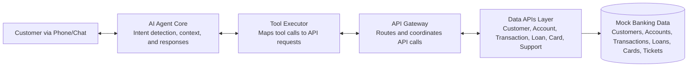

# Banking Call Center Agentic AI — Detailed Docs

This guide explains the business context, architecture, operations, and sample conversations for the demo agent.

## Business case
Banks and credit unions can use an agentic AI to triage and resolve common support requests (balances, card issues, loan schedules) without waiting for a human representative. The agent hands off complex cases with full context to minimize customer effort and reduce average handle time.

## Architecture


### Component highlights
- **AI Agent Core**: Understands intents, keeps conversation context, and crafts responses.
- **Tool Executor**: Selects and invokes tools that map to backend capabilities.
- **API Gateway**: Provides a single entry point to banking microservices and handles latency simulation.
- **Data APIs Layer**: Independent services for customer, account, transaction, loan, card, and support data.
- **Mock Database**: Pre-populated demo data to keep experimentation self-contained.

## Features
### Data APIs
The system simulates six banking microservices:
1. Customer API — Customer profiles, identification, verification.
2. Account API — Account information, balances, transfers.
3. Transaction API — Transaction history, search, spending analysis.
4. Loan API — Loan details, payment schedules, payoff calculations.
5. Card API — Card management, lost/stolen reporting, blocking.
6. Support API — Ticket creation, tracking, escalation.

### Agent capabilities (tools)
- Customer identification by phone/email and verification.
- Balance checks across accounts and transaction history search.
- Transfers, loan payment schedules, and payoff lookups.
- Card blocking, lost/stolen handling, and replacement workflows.
- Support ticket creation, updates, and escalation paths.

### Mock data
- Five demo customers with varied segments and products.
- Checking, savings, and money market accounts with balances.
- Rich transaction history with diverse merchants.
- Active auto, mortgage, and personal loans.
- Debit and credit cards plus support ticket history.

## Operations
1. Install dependencies: `pip install -r requirements.txt`.
2. Launch notebooks (preferred interface): `jupyter lab` or `jupyter notebook`.
3. Run the demos:
   - `notebooks/agent_demo.ipynb` for the conversational agent walkthrough.
   - `notebooks/api_demo.ipynb` for the API layer showcase.
4. CLI alternatives remain available via `python run_demo.py --demo` and `python run_api_demo.py`.

Configuration via environment variables (e.g., `.env` stored under `credentials/`):
```bash
# AI Provider (mock for demo, openai or anthropic for production)
AI_PROVIDER=mock

# API Simulation Settings
API_LATENCY_MIN_MS=50
API_LATENCY_MAX_MS=200

# Logging
LOG_LEVEL=INFO
```

## Sample interactions
### Auto-login welcome with top questions
```
Agent: Welcome back to SecureBank! I've signed you in with your saved profile. Here are the top 3 things customers ask:
        1) What's my balance?  2) Recent transactions?  3) Card or loan help?
        How can I help you today?
```

### Lost credit card handling
```
You: I lost my credit card.
Agent: I see a transaction happened 2 minutes ago—do you want to mark this as fraud? I can also block the credit card and initiate a new one.
You: Do both.
Agent: Done. The card is blocked and a new card is being issued. You'll receive it in 7 days; a tracking number will be shared in 1-2 business days.
Agent: I also see 5 transactions in the last 10 days. Do you want to mark them as fraud?
You: I am good.
Agent: Thanks for confirming. I've logged the update—anything else I can help with?
```

## Folder structure and guardrails
- `credentials/` and `data/` are git-ignored to keep secrets and local artifacts out of version control (see `.gitignore`).
- `notebooks/` holds runnable Jupyter flows so experimentation stays reproducible.
- `docs/` can expand with playbooks, benchmarks, and domain notes as the agent evolves.

## Future improvements
- Plug in real LLM providers for production-grade responses.
- Add authentication/authorization around the tool executor.
- Expand observability with tracing across API calls.
- Provide CI-ready notebooks for benchmarking and evaluation.
- Add more edge-case demos (disputes, travel notices, rate comparisons).
